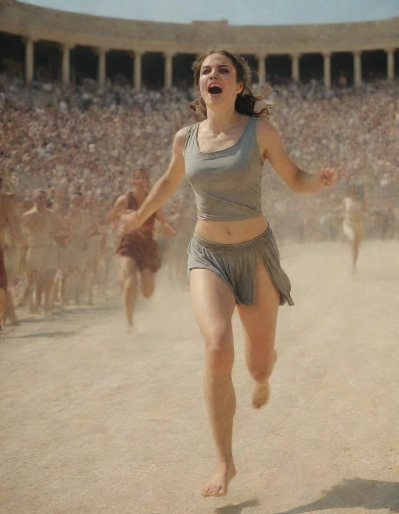

# wp24-athletes

This is a simple open REST API for immaginary ancient greece athletes.
It was written for the third mini homework of the
[Web Programming M-Z](https://perceivelab.github.io/wp-mz-24) @ DIEEI
course.

## Endpoints

All the endpoints use the `GET` method.

### /

Return information about the API.

For example, `curl -s http://<URL of the athletes API>/ | jq`:

```json
{
  "description": "A simple open REST API for athletes!",
  "version": "0.1"
}
```

### /athletes

Return the alphabetically ordered list of athletes.

For example, `curl -s http://<URL of the athletes API>/athletes | jq`:

```json
[
  {
    "slug": "arrhichione-di-fliunte",
    "name": "Arrhichione di Fliunte",
    "gender": "M",
    "age": 26,
    "sport": "Lotta",
    "famous_for": "Conosciuto per il suo successo nella lotta e il suo sacrificio durante una competizione."
  },
  {
    "slug": "astioco-di-taranto",
    "name": "Astioco di Taranto",
    "gender": "M",
    "age": 25,
    "sport": "Lotta",
    "famous_for": "Conosciuto per la sua forza e abilità nella lotta."
  },
  {
    "slug": "callias-di-atene",
    "name": "Callias di Atene",
    "gender": "M",
    "age": 24,
    "sport": "Danza",
    "famous_for": "Rinomato per la sua destrezza nella danza."
  },
  {
    "slug": "chryseis-di-larissa",
    "name": "Chryseis di Larissa",
    "gender": "F",
    "age": 24,
    "sport": "Lancio del giavellotto",
    "famous_for": "Famosa per la sua agilità e velocità nel lancio del giavellotto."
  },

  MORE ENTRIES...

]
```

### /athletes/{slug}

Return the specified athlete.

For example, `curl -s http://<URL of the athletes API>/athletes/theodora-di-creta | jq`:

```json
{
  "slug": "theodora-di-creta",
  "name": "Theodora di Creta",
  "gender": "F",
  "age": 26,
  "sport": "Lancio del disco",
  "famous_for": "Famosa per la sua abilità nel lancio del disco."
}
```

### /search

Search for athletes by `name`, `sport` or `famous_for`. You have to pass
them as query params.

For example, `curl -s http://<URL of the athletes API>/search\?sport\=salto | jq`:

```json
[
  {
    "slug": "thalia-di-mileto",
    "name": "Thalia di Mileto",
    "gender": "F",
    "age": 25,
    "sport": "Salto in lungo",
    "famous_for": "Famosa per la sua destrezza nel salto in lungo."
  }
]
```

### /images/{slug}

Return a picture of the athlete. You can specify `size=M` or `size=S` as query params to alter picture size.

> [!NOTE]
> All the pictures where generated locally using Stable Diffusion XL.

For example, `curl -s http://<URL of the athletes API>/images/eurydice-di-corinto\?size\=M | feh -` will show:



### /random

Return a random athlete.

For example, `curl -s http://localhost:8080/random | jq`:

```json
{
  "slug": "diagora-di-rodi",
  "name": "Diagora di Rodi",
  "gender": "M",
  "age": 32,
  "sport": "Pugilato",
  "famous_for": "Celebre per il suo successo nel pugilato."
}
```

## Deploy using podman

*Suppose you want to use the latest tag.*

```
podman run -p 8080:8080 quay.io/eriol/wp24-athletes:latest
```
